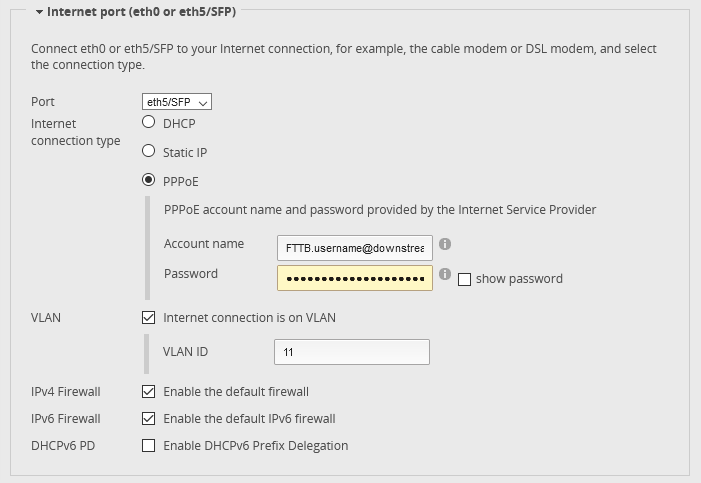

# Physical Connection
You should receive a SFP module from Init7 or you can order a [hardware bundle](https://www.digitec.ch/en/s1/product/fiber7-hardwarebundle-3m-glasfaserkabel-network-accessories-2759248) on Digitec. Then you can plug the SFP module into the Eth5 slot and connect it to the OTO socket indicated on the data sheet.

# Automatic Configuration
Just do the Basic Setup wizard with the information provided on the data sheet. Make sure to tick "Internet Connection is on VLAN" and provide the correct VLAN ID:


# Manual Configuration
## Firewall Rules
### IPv6 Rules
The ICMPv6 is needed for DHCPv6 prefix delegation and other IPv6 related workings
```.boot
ipv6-name WANv6_IN {
    default-action drop
    description "WAN Inbound traffic forward to LAN"
    rule 10 {
        action accept
        description "Allow established/related sessions"
        protocol all
        state {
            established enable
            related enable
        }
    }
    rule 20 {
        action drop
        description "Drop invalid packages"
        protocol all
        state {
            invalid enable
        }
    }
    rule 30 {
        action accept
        description "Allow ICMPv6"
        protocol ipv6-icmp
    }
}
ipv6-name WANv6_LOCAL {
    default-action drop
    description "WAN Inbound traffic to the router"
    rule 10 {
        action accept
        description "Allow established/related sessions"
        protocol all
        state {
            established enable
            related enable
        }
    }
    rule 20 {
        action drop
        description "Drop invalid state"
        protocol all
        state {
            invalid enable
        }
    }
    rule 30 {
        action accept
        description "Allow ICMPv6"
        protocol ipv6-icmp
    }
    rule 40 {
        action accept
        description "Allow DHCPv6"
        destination {
            port 546
        }
        protocol udp
        source {
            port 547
        }
    }
}
ipv6-name WANv6_OUT {
    default-action accept
    description "WAN outbound traffic"
    rule 10 {
        action accept
        description "Allow established/related"
        state {
            established enable
            related enable
        }
    }
    rule 20 {
        action reject
        description "Reject invalid state"
        state {
            invalid enable
        }
    }
}
ipv6-receive-redirects disable
ipv6-src-route disable
ip-src-route disable
log-martians enable
```
### IPv4 Rules
```.boot
name WAN_IN {
    default-action drop
    description "WAN to internal"
    rule 10 {
        action accept
        description "Allow established/related"
        state {
            established enable
            related enable
        }
    }
    rule 20 {
        action drop
        description "Drop invalid state"
        state {
            invalid enable
        }
    }
}
name WAN_LOCAL {
    default-action drop
    description "WAN to router"
    rule 10 {
        action accept
        description "Allow established/related"
        state {
            established enable
            related enable
        }
    }
    rule 20 {
        action drop
        description "Drop invalid state"
        state {
            invalid enable
        }
    }
}
name WAN_OUT {
    default-action accept
    rule 10 {
        action drop
        description "Drop Invalid"
        log enable
        state {
            invalid enable
        }
    }
}
receive-redirects disable
send-redirects enable
source-validation disable
syn-cookies enable
```

## Interface Configuration
### Internet (eth5)
```.boot
ethernet eth5 {
    description Hybrid7
    duplex auto
    speed auto
    vif 11 {
        pppoe 0 {
            default-route auto
            dhcpv6-pd {
                pd 0 {
                    prefix-length 48
                }
                rapid-commit enable
            }
            firewall {
                in {
                    ipv6-name WANv6_IN
                    name WAN_IN
                }
                local {
                    ipv6-name WANv6_LOCAL
                    name WAN_LOCAL
                }
                out {
                    ipv6-name WANv6_OUT
                    name WAN_OUT
                }
            }
            ipv6 {
                address {
                    autoconf
                }
                dup-addr-detect-transmits 1
                enable {
                }
            }
            mtu 1492
            name-server auto
            password *****
            user-id FTTH.username@downstream.ch
        }
    }
}
```

### Switch
Configuration for a SLAAC with Router Advertisement setup (IP address determined by client, Router and DNS information provided by router)
```.boot
switch switch0 {
    address 192.168.1.1/24
    address 2001:1620:<YOUR PREFIX>:<CHOSEN SUBNET>::1/64
    description LocalNetwork
    ipv6 {
        dup-addr-detect-transmits 1
        router-advert {
            cur-hop-limit 64
            link-mtu 0
            managed-flag false
            max-interval 600
            name-server 2001:1620:2777:1::10
            name-server 2001:1620:2777:2::20
            other-config-flag false
            prefix 2001:1620:<YOUR PREFIX>:<CHOSEN SUBNET>::/64 {
                autonomous-flag true
                on-link-flag true
                valid-lifetime 2592000
            }
            reachable-time 0
            retrans-timer 0
            send-advert true
        }
    }
    mtu 1500
    switch-port {
        interface eth0 {
        }
        interface eth1 {
        }
        interface eth2 {
        }
        interface eth3 {
        }
        interface eth4 {
        }
        vlan-aware disable
    }
}
```
